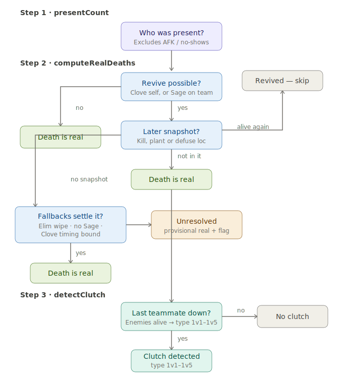

# Valorant clutch detection

A reference implementation for detecting 1vX clutch situations from raw Valorant match data. Riot's API exposes no clutch flag anywhere, so everything is reconstructed from the kill feed and the positional snapshots (`player_locations`) attached to kill, plant, and defuse events.

The hard part isn't spotting the 1vX — it's that a death in the kill feed isn't always permanent. Sage's Resurrection and Clove's Not Dead Yet put a player back in the round, so a naive death count reports clutches that never happened and misses ones that did. This library resolves each death three ways: direct positional evidence where a later snapshot exists, mechanical fallbacks (elimination wipes, no-revive-source, a sourced 17.3s Clove self-revive timing bound) where it doesn't, and an explicit `unresolved` flag for the narrow class of Sage-revivable final-kill deaths the data genuinely can't settle. It also corrects for absent/AFK players who never die and would otherwise hide a clutch entirely.

Three functions — `presentCount`, `computeRealDeaths`, `detectClutch` — return who was really in the round, which deaths were real, and whether the tracked player ended up last-alive with enemies remaining (and of what type). Built and cross-checked against real match data from first principles; validated against Riot's `CeremonyClutch` tag (144/144 and 108/108 across two datasets) and an independent elimination-count check. No prior public implementation to copy from. MIT-licensed.

## The pipeline at a glance

Every round runs through three sequential stages. The first two establish the ground truth — who was really in the round, and which deaths actually stuck — and the third decides whether the tracked player ended up in a clutch and how large it was.

---

## Step 1 — `presentCount`: who was actually in the round?

A round is not always 5v5. A disconnected or never-loaded teammate never dies, which quietly breaks the "last one alive" trigger in Step 3: if the code assumes five teammates but only four are present, it waits for a fifth death that never comes, and the whole clutch stays invisible.

`presentCount` fixes the starting alive-count per side. It prefers positional evidence — the earliest `player_locations` snapshot in the round (from a kill, plant, or defuse) tells it who was actually on the map — and falls back to Riot's `was_afk` / penalty flags when no snapshot is available. The resulting counts feed Step 3 as `startMyAlive` / `startEnemyAlive` instead of a hardcoded 5/5.

Validated against the penalty-flag method across 3,205 rounds that have a snapshot, over two independent datasets: the two methods agree on every single player-round, zero disagreements. The snapshot is preferred anyway because it's direct observation rather than a flag, so a brief AFK stint that never trips Riot's penalty threshold can't defeat it.

## Step 2 — `computeRealDeaths`: which deaths were real?

This is the heart of the tool. A death in the kill feed is not necessarily permanent, because two abilities can undo it:

- **Sage's Resurrection** — revives a dead teammate, any time before the round ends, with no timer of its own.
- **Clove's Not Dead Yet** — Clove self-revives, but must get a kill or damaging assist within a fixed timer or die again.

Counting raw deaths therefore over-counts. `computeRealDeaths` returns, for each player, the timestamp of their *real* death — or marks them `unresolved` when the data genuinely cannot say.

### The revive gate

Before any expensive work, the function asks whether a revive was even *mechanically possible* for this player: are they Clove, or is there a Sage on their team? If neither, the first death is real, full stop — this closes roughly 79% of all death events immediately. Only the remaining ~21% get the full walk below.

### The walk (per death, in order)

**1. Positional evidence.** Every kill, plant, and defuse event carries a `player_locations` snapshot listing who was alive at that instant. If any snapshot *after* this death shows the player alive again, the death was undone — keep walking to their next death. If a later snapshot exists and the player is absent from it, the death is real. This is direct observation, not inference.

> Note: this check runs for *every* death, including ability-tagged ones. A Clove whose own Not Dead Yet expires ("died to Not Dead Yet" in the feed) can still be resurrected afterward by a Sage teammate — so the ability tag is never treated as automatically final. There is a confirmed real case of exactly this in the test data.

**2. No later snapshot — round-result fallbacks.** This happens almost only on a round's final kill, where no further event exists to check against. Three fallbacks can still settle it:

- **Elimination wipe.** If the round ended by `Elimination` and this player's team *lost*, the entire losing side must be dead — the death is real.
- **No revive source left.** If the player isn't Clove and has no living Sage teammate at that moment, no revive could occur — real.
- **Clove timing bound (2b).** If Clove's own self-revive is the *only* possible route (she's Clove, no live Sage), a successful revive would require either a later kill in the feed (there is none) or the round ending before her timer expired. If neither holds — no later kill, and the round ran on longer than the maximum possible Not Dead Yet window past her death — a revive is mechanically ruled out, so the death is real. See the timing constant below.

**3. Unresolved.** If nothing settles it, the death is marked `unresolved`: recorded provisionally as real, but flagged so any stat derived from that round can be treated as uncertain.

### The Clove timing ceiling

`MAX_CLOVE_SELF_REVIVE_WINDOW_MS = 17300` is the absolute maximum time from Clove's original death to her Not Dead Yet timer expiring. It is built entirely from confirmed values:

| Component | Duration |
|---|---|
| Activation window (decide + cast) | ~3.0 s |
| Revive windup | 1.5 s |
| Max intangibility | 2.0 s |
| Deactivation animation | 0.8 s |
| Resurrection timer (kill/assist deadline) | 10.0 s |
| **Total** | **17.3 s** |

This was cross-checked against 38 confirmed real Not Dead Yet timeouts in the test data — the largest observed death-to-timeout gap was 16.86 s, comfortably under the ceiling, so it's a validated bound rather than a paper one.

The round-end estimate this is compared against **includes the 7-second Post-Round Phase**, because Clove's timer keeps running through it — she only becomes safe once the *next* Buy Phase begins, not when the round's outcome is decided. Hence `CLOVE_REVIVE_SPIKE_BOUNDARY_MS = 45000 + 7000` and `CLOVE_REVIVE_ROUND_BOUNDARY_MS = 100000 + 7000`. (Buy Phase is separate and not counted in `time_in_round_in_ms`, confirmed empirically: if it were, unplanted-round kills would top out near 130s, but the observed maximum across 113 matches was 106.7s — matching nominal Round Phase plus the 7s Post-Round Phase.)

## Step 3 — `detectClutch`: was there a clutch, and what kind?

Walks the round's kills in order, decrementing each side's alive-count using **only real deaths** from Step 2 — so a teammate who died and was revived still counts as standing, and the player was never truly "last alive" if someone came back up.

The clutch triggers the instant the tracked player becomes their team's sole survivor (`myAlive === 1`) with at least one enemy still up. The number of enemies alive at that moment is the **clutch type** (1v1 through 1v5). If the enemy team was already wiped at that instant, it isn't a clutch — the round was already won. Returns `null` when no clutch occurred, otherwise an object carrying `clutchType`, `clutchStartMs`, and supporting fields.

Validated against two ground truths that don't depend on this code being right: Riot's own `CeremonyClutch` round tag, and an Elimination-round cross-check (the losing side must have exactly as many real deaths as it had players on the field). Across two independent datasets — 140 and 123 matches, different players and ranks — `CeremonyClutch` matched 144/144 and 108/108 with zero misses, and Elimination mismatches were 0 on both. (`CeremonyClutch` is reliable when present but far too sparse to detect *with* — Riot shows only one badge per round, prioritizes Ace/Thrifty/etc. over Clutch, never badges losses, and tags only ~2% of true 1v1 wins — so it's used only as a verification signal, never as the source.)

## Unresolved deaths

An `unresolved` death (Step 2, case 3) means the data genuinely can't say whether a specific death stuck. One class of situation is inherently unresolvable and correctly stays flagged: a **Sage-revivable death** that is the round's last kill event, where no later positional snapshot exists. Sage's Resurrection has no timer, so unlike the Clove case there's no clock to prove the revive couldn't have happened — she could revive at any point up to round end, and nothing in the data rules it out. This is the intended floor of what's determinable, not a gap in the logic.

Whether an `unresolved` death should invalidate a downstream stat depends on whether the ambiguity actually reaches that stat — many clutch situations are unaffected by it (e.g. the ambiguous death fell outside the trigger logic entirely). Handling that is left to the consumer of these functions; `computeRealDeaths` simply surfaces the flag via the returned `unresolved` set.

## Key files and constants

| Name | Role |
|---|---|
| `presentCount` | Step 1 — starting alive-counts per side |
| `computeRealDeaths` | Step 2 — real vs. revived deaths; returns `{ realDeath, unresolved }` |
| `detectClutch` | Step 3 — clutch trigger + type (1v1–1v5) |
| `MAX_CLOVE_SELF_REVIVE_WINDOW_MS` | 17300 — Not Dead Yet ceiling (Step 2b) |
| `CLOVE_REVIVE_SPIKE_BOUNDARY_MS` | 45000 + 7000 — post-plant round-end incl. Post-Round Phase |
| `CLOVE_REVIVE_ROUND_BOUNDARY_MS` | 100000 + 7000 — unplanted round-end incl. Post-Round Phase |
| `REVIVE_MIN_GAP_MS` | 3000 — trade-vs-revive jitter threshold |
